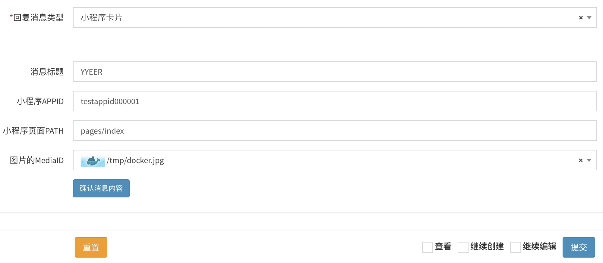

# An editor for WeChat Custom Service Message.

This is a `laravel-admin` extension that can edit WeChat Custom Service Message with form input.

## Screenshot



## Installation

First, install dependencies:

```bash
composer require yisonli/wxmsg
```

## Usage

Use it in the form form:

```php
$form->wxmsg('content');
```

Advance Usage : 

- function `relateTo` : Diy message type field.
- function `selectMedia` : Query mediaID list by ajax api.

```php
$form->select('app_id', '公众号')->options($app_list)->rules('required');
$form->select('msgtype', '回复消息类型')->options([
        'text' => '文本',
        'image' => '图片',
        'news' => '图文',
        'link' => '图文(小程序)',
        'miniprogrampage' => '小程序卡片',
    ])->rules('required');
$form->wxmsg('content', '')->relateTo('msgtype', 'app_id')->selectMedia('/wechat/reply/medias');
```

> While using selectMedia, you must add the Controller Function for `/wechat/reply/medias` first.

1) Add controller function:

```php
public function medias(Request $request)
{
    $app_id = $request->get('a');
    $name = $request->get('q');
    $type = $request->get('t');

    $result = WechatMedia::where('app_id', '=', $app_id)
        ->where('type', '=', $type)
        ->where('name', 'like', "%$name%")
        ->paginate(null, ['media_id', 'name', 'url']);

    foreach ($result as $key => $value) {
        $temp = [
            'id' => $value['media_id'],
            'text' => ' ' . $value['name'],
        ];
        $result[$key] = $temp;
    }

    return $result;
}
```

2) Add api to route file:

```php
$router->get('/wechat/reply/medias', 'Wechat\ReplyController@medias');
```

## Support Message Types
- text
- image
- news
- link
- miniprogrampage

## To be continue
- Support other message types. (exp: video, music, msgmenu...)
- Beautify the operation interface.

## License

Licensed under [The MIT License](LICENSE).

## About Me
name: yison.li  
blog: [http://yyeer.com](http://yyeer.com)  
github: [https://github.com/yisonli](https://github.com/yisonli)

